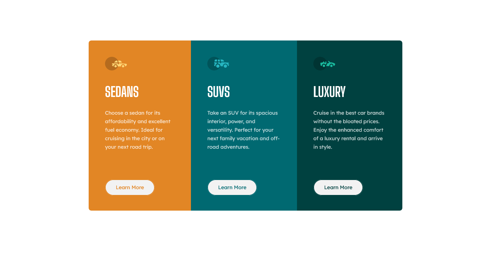

# Frontend Mentor - 3-column preview card component solution

This is a solution to the [3-column preview card component challenge on Frontend Mentor](https://www.frontendmentor.io/challenges/3column-preview-card-component-pH92eAR2-). Frontend Mentor challenges help you improve your coding skills by building realistic projects.

## Table of contents

- [Overview](#overview)
  - [The challenge](#the-challenge)
  - [Screenshot](#screenshot)
  - [Links](#links)
- [My process](#my-process)
  - [Built with](#built-with)
  - [What I learned](#what-i-learned)
  - [Continued development](#continued-development)
- [Author](#author)

## Overview

### The challenge

Users should be able to:

- View the optimal layout depending on their device's screen size
- See hover states for interactive elements

### Screenshot

### Links

- Solution URL: [Add solution URL here](https://your-solution-url.com)
- Live Site URL: https://lucasw92.github.io/3-column-preview-card-component-main/

## My process

I start by identifying the containers for objects, since this helps me understand the general layout, after that I code these containers in HTML, then I add the objects(images, text, buttons) to them.
Once I have a skeleton html, I start adding the CSS, first the colors, font types, sizes.
After that I move on to applying the general layout, margins, heights, this part is usually the tricky one.

### Built with

- Semantic HTML5 markup
- CSS custom properties
- Flexbox

### What I learned

This is the second Frontend Mentor challenge that I finish, I am trying to follow the challenge roadmaps so i'm always building new sites that incrementally ramp up the difficulty.

In this challenge I learned more about css and how to use margin/padding to help place the objects in the correct location on screen.

### Continued development

I still need alot of training with the box model and with centralizing images on screen.

## Author

- Frontend Mentor - [@LucasW92](https://www.frontendmentor.io/profile/LucasW92)
